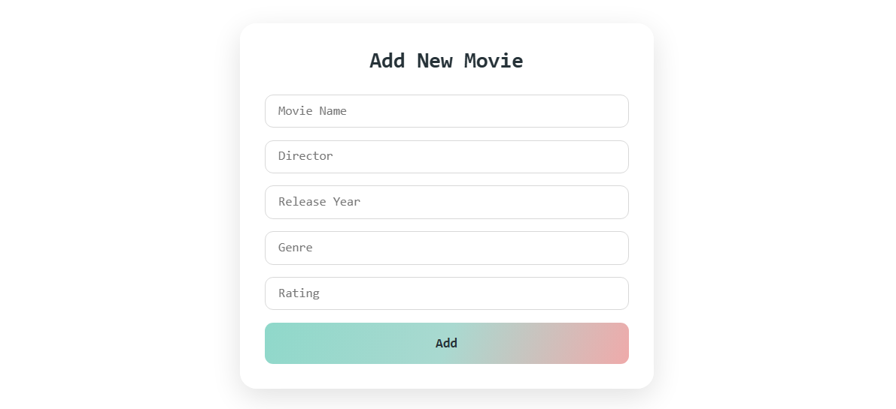
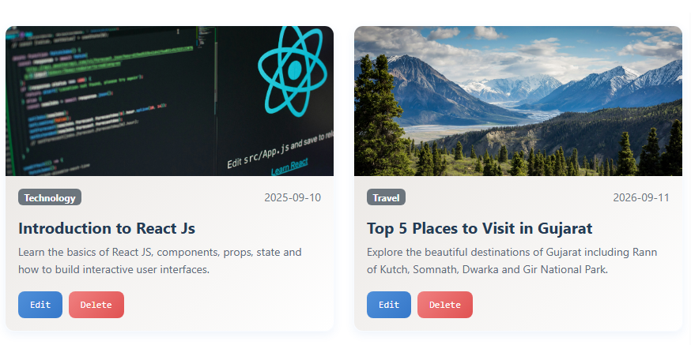

# 🎬 Movie Collection CRUD App

A simple and responsive **Movie Collection CRUD Application** built using **React.js** and **JSON Server**.

This project allows users to **add, view, edit, and delete movie details** using CRUD operations.

---

## 🚀 Technologies Used

* HTML
* CSS
* Bootstrap
* JavaScript
* React.js
* JSON Server
* Fetch API

---

## ✨ Features

* View all movies
* Add a new movie
* Edit movie details
* Delete a movie
* Movie Title
* Director
* Release Year
* Genre
* Rating
* Responsive movie cards
* JSON Server for storing movie data
* REST API integration
* CRUD operations

---

# 🔄 Project Workflow

The application works through the following workflow:

```text
User
  ↓
React Application
  ↓
Movie Form
  ↓
Add / Edit Movie
  ↓
Fetch API
  ↓
JSON Server
  ↓
db.json
  ↓
Movie Data
  ↓
React State
  ↓
Movie Cards
```

---

## 1️⃣ GET – Display Movies

When the application starts, React uses `useEffect()` to send a **GET request** to JSON Server.

```text
React
  ↓
GET Request
  ↓
JSON Server
  ↓
Movies Data
  ↓
React State
  ↓
Movie Cards
```

All movie data is fetched from JSON Server and displayed in the movie cards.

---

## 2️⃣ CREATE – Add Movie

The user enters the following movie details:

* Movie Title
* Director
* Release Year
* Genre
* Rating

Then clicks the **Add** button.

```text
Movie Form
    ↓
movieData
    ↓
POST Request
    ↓
JSON Server
    ↓
db.json
    ↓
New Movie Added
```

The new movie is stored in the JSON Server database.

---

## 3️⃣ UPDATE – Edit Movie

When the user clicks the **Edit** button, the selected movie data is loaded into the form.

```text
Movie Card
    ↓
Edit Button
    ↓
handleEdit()
    ↓
Movie Data → Form
    ↓
User Changes Data
    ↓
PUT Request
    ↓
JSON Server
    ↓
Movie Updated
```

The selected movie details are updated using the **PUT** method.

---

## 4️⃣ DELETE – Delete Movie

When the user clicks the **Delete** button:

```text
Delete Button
    ↓
Movie ID
    ↓
DELETE Request
    ↓
JSON Server
    ↓
Movie Removed
```

The selected movie is removed from the JSON Server database and movie list.

---

# 🔁 CRUD Operations

| Operation | HTTP Method | API Endpoint  |
| --------- | ----------- | ------------- |
| Create    | POST        | `/movies`     |
| Read      | GET         | `/movies`     |
| Update    | PUT         | `/movies/:id` |
| Delete    | DELETE      | `/movies/:id` |

---

# 🖥️ Project Output / Screenshots

## 📝 Movie Form

The form is used to enter movie information such as title, director, release year, genre, and rating.



---

## 🎬 Movie Collection

The movie collection displays all movies in responsive cards with their details, rating, Edit button, and Delete button.



---

# 📸 Project Screenshots

The project screenshots are stored inside the `assets` folder.

```text
assets/
├── form.png
└── collection.png
```

---

# 🎥 Video Explanation

## Project Explanation Video

In this video, I explain the complete **Movie Collection CRUD Project**, including:

* Project introduction
* React application structure
* `useState`
* `useEffect`
* JSON Server
* Fetch API
* GET operation
* POST operation
* PUT operation
* DELETE operation
* Add Movie
* Edit Movie
* Delete Movie
* Movie Collection
* Project output

### ▶️ Video Link

[Watch Project Explanation Video](YOUR_VIDEO_LINK_HERE)

> Replace `YOUR_VIDEO_LINK_HERE` with your actual YouTube or Google Drive video link.

---

# ⚙️ How to Run the Project

## 1. Clone Repository

```bash
git clone YOUR_GITHUB_REPOSITORY_LINK
```

## 2. Open Project

```bash
cd movie-crud
```

## 3. Install Dependencies

```bash
npm install
```

## 4. Start JSON Server

Run the following command:

```bash
npx json-server --watch db.json
```

The JSON Server API will run at:

```text
http://localhost:3000/movies
```

## 5. Start React Application

Open another terminal and run:

```bash
npm run dev
```

Then open the local URL provided by Vite in your browser.

---

# 📂 Project Structure

```text
movie-crud/
│
├── src/
│   ├── App.jsx
│   ├── App.css
│   └── main.jsx
│
├── assets/
│   ├── form.png
│   └── collection.png
│
├── db.json
├── package.json
├── package-lock.json
└── README.md
```

---

# 🧠 React Concepts Used

* `useState`
* `useEffect`
* Event Handling
* Form Handling
* Conditional Rendering
* `map()`
* `filter()`
* Fetch API
* REST API
* CRUD Operations
* JSON Server
* State Management

---

# 📡 API Integration

The project uses **JSON Server** as a local REST API.

### API URL

```text
http://localhost:3000/movies
```

### GET

Used to fetch all movies.

```text
GET /movies
```

### POST

Used to add a new movie.

```text
POST /movies
```

### PUT

Used to update an existing movie.

```text
PUT /movies/:id
```

### DELETE

Used to delete a movie.

```text
DELETE /movies/:id
```

---

# 🎯 Project Purpose

The main purpose of this project is to understand how **React.js communicates with a REST API** and how CRUD operations are performed in a web application.

This project helped me improve my practical knowledge of:

* React.js
* API Integration
* JSON Server
* Fetch API
* Form Handling
* State Management
* CRUD Operations
* REST API

---

# 📚 What I Learned

Through this project, I learned how to:

* Create a React application
* Manage data using `useState`
* Fetch API data using `useEffect`
* Send GET, POST, PUT, and DELETE requests
* Connect React with JSON Server
* Create and handle forms
* Display dynamic data using `map()`
* Delete data using `filter()`
* Update existing data
* Build a responsive movie collection interface

---

# 👨‍💻 Author

**Yasin**

Full Stack Development Student

---
